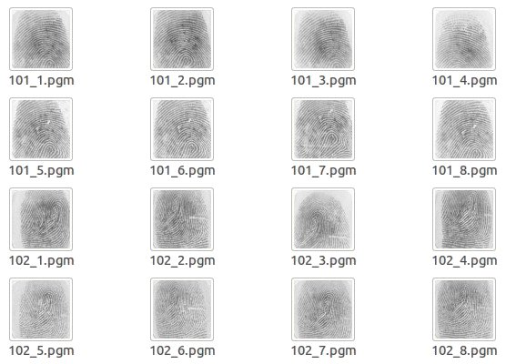

pgafis
======

pgAFIS - Automated Fingerprint Identification System support for PostgreSQL



# Sample fingerprints data

```sql
    Table "public.fingerprints"
 Column |     Type     | Modifiers 
--------+--------------+-----------
 id     | character(5) | not null
 pgm    | bytea        | 
 wsq    | bytea        | 
 mdt    | bytea        | 
Indexes:
    "fingerprints_pkey" PRIMARY KEY, btree (id)
```
- "pgm" stores original raw fingerprint images (PGM)
- "wsq" stores compressed fingerprint images (WSQ)
- "mdt" stores fingerprint templates in XYTQ own binary format (MDT)

```sql
afis=>
SELECT id,
  length(pgm) AS raw_bytes,
  length(wsq) AS wsq_bytes,
  length(mdt) AS mdt_bytes
FROM fingerprints
LIMIT 5;

  id   | raw_bytes | wsq_bytes | mdt_bytes 
-------+-----------+-----------+-----------
 101_1 |    180029 |      9002 |       329
 101_2 |    180029 |      8808 |       261
 101_3 |    180029 |      8985 |       313
 101_4 |    180029 |      9503 |       365
 101_5 |    180029 |      8857 |       317
(5 rows)
```

# Acquisition

## Image Compression (WSQ)

```sql
afis=>
UPDATE fingerprints
SET wsq = cwsq(pgm, 0.75, 300, 300, 8, null)
WHERE wsq IS NULL;
```
- compressed image in WSQ format is generated from original fingerprint raw image (PGM format)

## Feature Extraction (XYT)

```sql
afis=>
UPDATE fingerprints
SET mdt = mindt(wsq, true)
WHERE mdt IS NULL;
```
- minutiae data are extracted from compressed WSQ image and stored in own binary format (MDT)

# Verification (1:1)

```sql
afis=>
SELECT (bz_match(a.mdt, b.mdt) >= 40) AS match
FROM fingerprints a, fingerprints b
WHERE a.id = '101_1' AND b.id = '101_6';

 match 
-------
 t
(1 row)
```
- given two fingerprint templates, they can be considered the same according to a threshold value (e.g., 40) defined by the application


# Identification (1:N)

```sql
afis=>
SELECT a.id AS probe, b.id AS sample,
  bz_match(a.mdt, b.mdt) AS match
FROM fingerprints a, fingerprints b
WHERE a.id = '101_1' AND b.id != a.id
  AND bz_match(a.mdt, b.mdt) >= 40
LIMIT 3;

 probe | sample | match 
-------+--------+-------
 101_1 | 101_3  |    45
 101_1 | 101_4  |    57
 101_1 | 101_6  |    47
(3 rows)
```
- sequential scan is performed on the table, but so far as a given number of templates (e.g., 3) having a match score above the defined threshold (e.g., 40)

